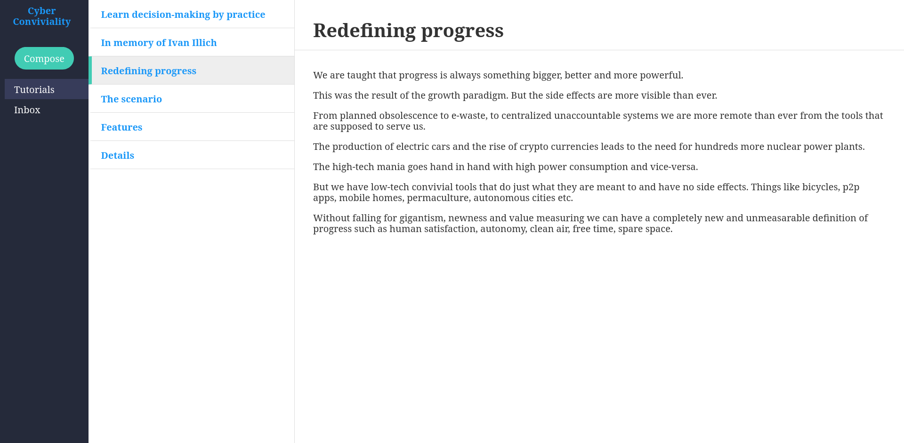
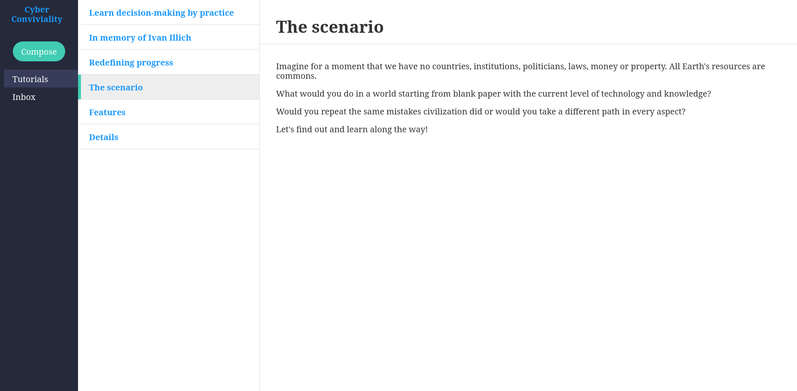
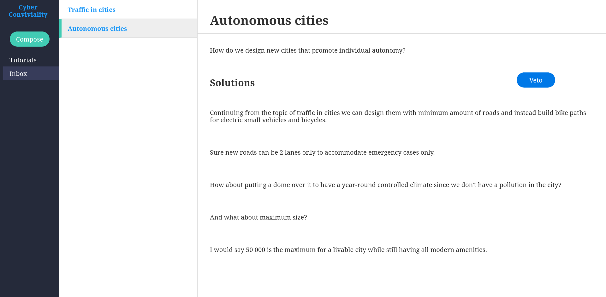
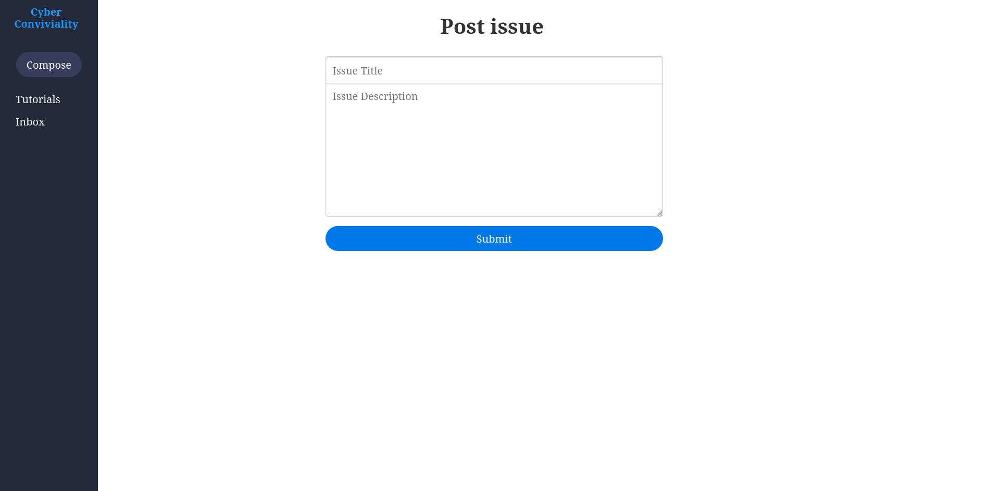
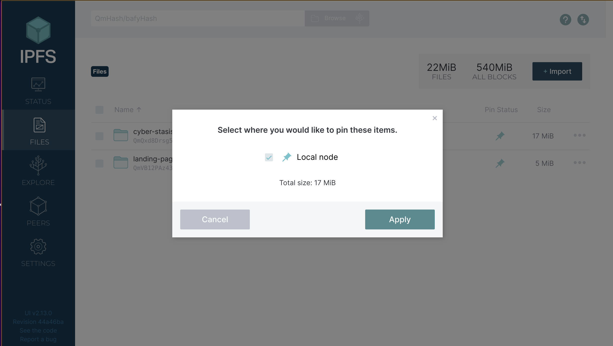

# Cyber Conviviality


## In memory of Ivan Illich

Do you know what are convivial tools?

Have you heard of Ivan Illich?

<a display="inline" href="https://monoskop.org/Ivan_Illich">
    Ivan Illich
</a>


Once you are familiar with the concepts you will be able to apply it successfully in finding convivial solutions to everyday problems.

## Learn decision-making by practice

Representative democracy and consumer culture deprived us from the learning process of decision making.

All instutions are hierarchical and train us to listen, behave and comply.

We have no say in decisions on any level from school, to work, to local council, to national and world scale.

We are deprived of our very nature to participate and have a say in our common daily matters.

Spaces which are by definition and history a commons such as our cities are de facto a state ownership.

Decision making is the same as any other ability, you need to practice to get good at it.

The purpose of the decision making simulator is to foster constructive collaboration, tolerance and empathy.

Decision making is an art. Learn to participate, collaborate, swallow up your ego, compromise and reach consensus for the greater good.

## How does it work?

Submit pressing issues based on convivial understanding of the world. Submit convivial tools and solutions. Discuss until a consensus is reached.

## Details

- Post real world issues

- Post suggestions how to solve them

- Practice negotiation, learning from others and tolerance towards reaching a common goal

- Enact veto and discuss further if needed

- Reach a consensus

- Be a community!

## Features

- Consensus based, majority democracy leads to a dictatorship of the majority over the minority and doesn't make people cooperate until a compromise is reached

- No voting, we need to learn how to compromise and reach consensus

- No moderation and no censorship, we need to be able to overcome hate and spam and still reach a decision

## Screenshots

<a display="inline" href="./assets/progress.png?raw=true">

</a>

<a display="inline" href="./assets/scenario.png?raw=true">

</a>

<a display="inline" href="./assets/inbox.png?raw=true">

</a>

<a display="inline" href="./assets/post-issue.png?raw=true">

</a>

## Community

https://www.reddit.com/r/CyberConviviality/

## Installation

The app runs on the public IPFS network. In order to use it follow the steps below:

1. Install the official IPFS Desktop http://docs.ipfs.io/install/ipfs-desktop/
2. Install IPFS Companion http://docs.ipfs.io/install/ipfs-companion/
3. Install golang 1.20 or later version - https://go.dev/doc/install
4.  Clone https://github.com/stateless-minds/kubo to your local machine
```
git clone https://github.com/stateless-minds/kubo.git
```
5.  Follow the instructions here to open your config file: https://github.com/ipfs/kubo/blob/master/docs/config.md. Usually it's `~/.ipfs/config` on Linux. Add the following snippet to the `HTTPHeaders`:
```{
  "API": {
    "HTTPHeaders": {
      "Access-Control-Allow-Origin": ["webui://-", "http://localhost:3000", "http://k51qzi5uqu5dgw8gbjzw16d1q2rmtkip85yklwk7aknkoc1fkf4qtaxb90ltc7.ipns.localhost:8080", "http://127.0.0.1:5001", "https://webui.ipfs.io"],
      "Access-Control-Allow-Credentials": ["true"],
      "Access-Control-Allow-Methods": ["PUT", "POST"]
    }
  },
 ```
6. Build it and start the daemon:
``` 
cd kubo
make build
./cmd/ipfs/ipfs daemon --enable-pubsub-experiment
```
7.  Navigate to <a href="https://ipfs.io/ipns/k51qzi5uqu5dgw8gbjzw16d1q2rmtkip85yklwk7aknkoc1fkf4qtaxb90ltc7">Cyber Conviviality</a>
8.  If you like the app consider pinning it to your local node so that you become a permanent host of it while you have IPFS daemon running



## Acknowledgments

1. <a href="https://go-app.dev/">go-app</a>
2. <a href="https://ipfs.io/">IPFS</a>
3. <a href="https://berty.tech/">Berty</a>
4. All the rest of the authors who worked on the dependencies used! Thanks a lot!

## Contributing

<a href="https://github.com/stateless-minds/cyber-hike/issues">Open an issue</a>

## License

Stateless Minds (c) 2023 and contributors

MIT License
